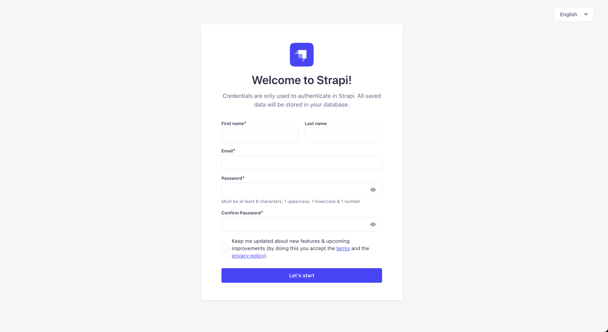
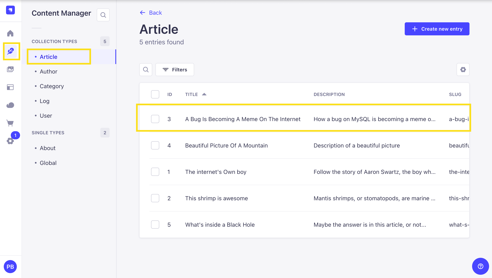
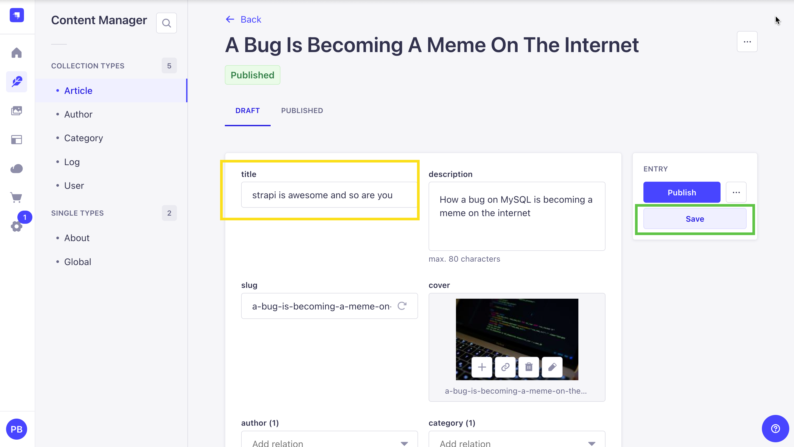
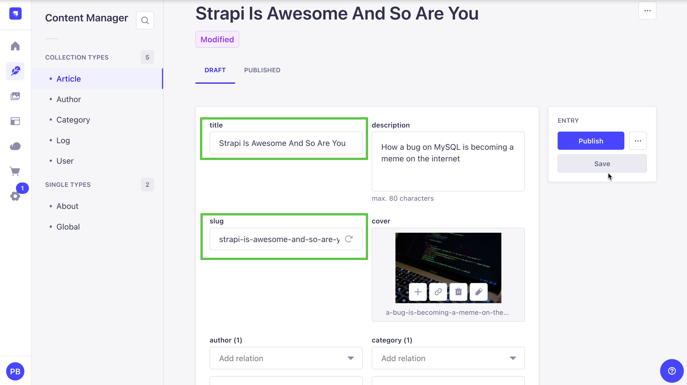
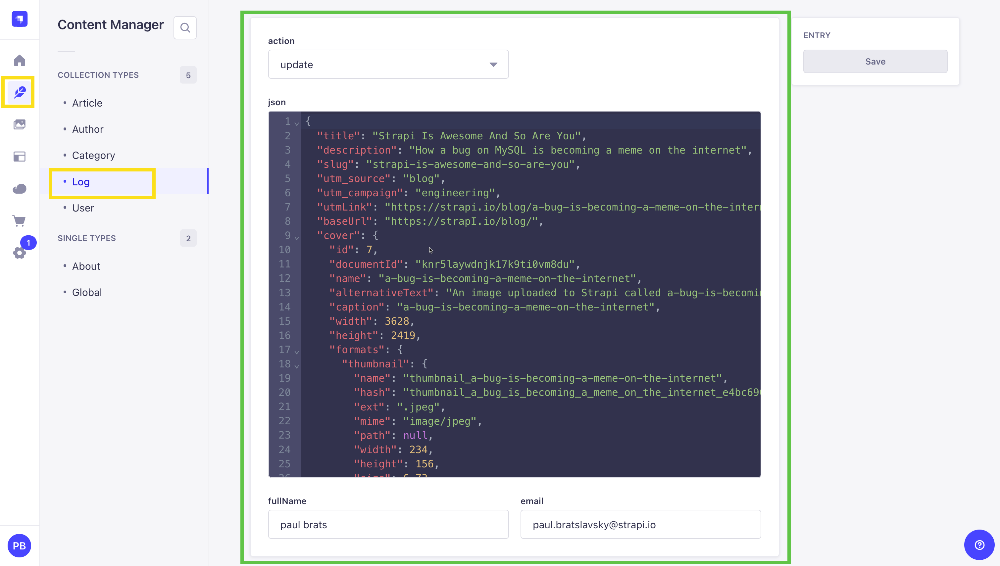
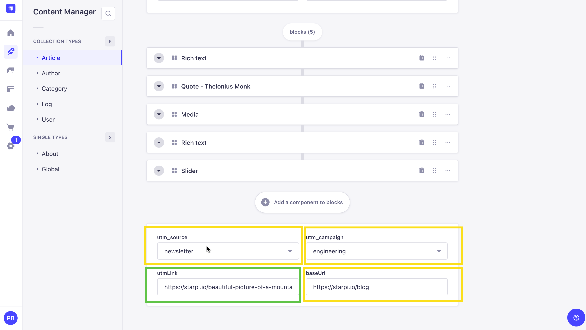

## **Introduction**

The Scene: You're [migrating from Strapi 4 to Strapi 5](https://docs.strapi.io/dev-docs/migration/v4-to-v5/step-by-step) to get access to a ton of new features such as improved content localization, draft-and-publish enhancements, content history, and more.

You back up your database, make sure your code is all committed in git, and run `npx @strapi/upgrade major` to [automatically migrate your project code](https://docs.strapi.io/dev-docs/upgrade-tool) for you. Everything goes smoothly, so you jump right in and start up your new Strapi 5 server. It works!

After exploring for a while, you notice something is off — quite literally. You go back and look at the changes made in your migrated codebase and you see it:

Your database lifecycle hooks have been commented out! And there's an ominous warning that they were disabled by default because they will not work as expected in Strapi 5. But what does that mean? What happened? Why would Strapi do that to your poor lifecycle hooks? And most importantly, what do you do next?

**Why?!**

Lifecycle hooks are tied to specific content types and trigger actions in your code from database activity. They were used to perform additional operations when content changes happened, such as sending email, calculating attribute values, or programmatically creating additional content. It worked well, because each piece of content was directly correlated with one database entry.

In Strapi 5, with the introduction of the document service to support draft-and-publish, content history, improved handling of multi-locale content and more, [the actions performed trigger more complex database activity](https://docs.strapi.io/dev-docs/migration/v4-to-v5/breaking-changes/lifecycle-hooks-document-service#table) than before. For instance, creating a new published document will result in `afterCreate` and `beforeCreate` hooks being called twice. That's because published versions are immutable — essentially permanent history written in stone — and a draft is also kept for edits to be made to your content. Trying to use a database lifecycle hook to figure out and filter what is being done at a higher level could quickly become a nightmare scenario.

Introducing ✨ **Document Service Middleware ✨ — a** new high-level approach to focus on what truly matters: the actual events in your Strapi project, rather than the database activity under the hood.

Document service middlewares can be used to extend the document service methods with new functionality or modify their existing functionality. They are loaded in your Strapi `register()` function and can affect multiple content types and actions with the same code. This makes them more flexible and lets you do more with less code.

Let's take a quick view of the differences between lifecycles and middleware.

| **DB Lifecycles**                                                          | **Document Service Middleware**                                                                                                                                  |
| -------------------------------------------------------------------------- | ---------------------------------------------------------------------------------------------------------------------------------------------------------------- |
| Exist in both Strapi 4 and Strapi 5                                        | New in Strapi 5                                                                                                                                                  |
| directly attached to a specific _content-type_                             | global; can be filtered by _content-type_                                                                                                                        |
| directly attached to a specific database query                             | global; can be filtered by the _actions_ being performed by the document Service                                                                                 |
| loaded from files stored in each content-api directory                     | loaded in `register()`                                                                                                                                           |
| `before` and `after` hooks to take action before or after a database query | Can trigger actions before and after a document service method is called, but can also modify the incoming parameters/data and the result returned by the method |

**Lifecycles vs. Middleware: Side-by-Side Examples**

To get a basic idea of how you might convert a lifecycle to a middleware, here's an example of a Strapi 4 lifecycle hook to generate a slug for an article if one wasn't provided

```tsx
// content-api/article/lifecycles.ts
module.exports = {
  lifecycles: {
    async beforeCreate(event) {
      const { data } = event.params;
      data.slug = data.slug || slugify(data.title);
    },
  },
};
```

This approach works well for a single content type like article, but it's not reusable across other types, such as blog or news. You have to copy and paste your file for each content type when they might all have a slug field that needs to be added. Additionally, extending this to handle locales or drafts would add significant complexity to the lifecycle logic. And finally, if you want to get a global view of all of your existing hooks, you have to look through every content type directory to find them.

Let's look at how that could be refactored using document service middleware in Strapi 5.

Document service middleware receive a `context` object and a `next` function.

The context action corresponds with the document service method that is actually being called (such as `create`, `update`, `delete`, `publish` , and `unpublish`).

It's important to note that the context object is a reference and any changes to it will affect other middleware called after this one. So all we have to do it modify it with whatever changes we want.

```tsx
// index.ts

// ...your other code

register({ strapi }) {
	strapi.documents.use(async (context, next) => {
	  // target the 'create' action on articles
	  if (context.uid == 'api::article.article' && context.action == 'create') {
	    context.params.data.slug = context.params.data.slug || slugify(context.params.data.title);
	  }

	  // always return next()
	  return next();
	});
}

// ...your other code
```

You can read about [context in the docs](https://docs.strapi.io/dev-docs/api/document-service/middlewares#context).

"I could have figured that out on my own" you say. Ok, fine, let's take a look at a more complex, real-world scenario, and then build it.

Let's say you're building a website using Strapi as the back-end. On the site, you will have articles, pages, and products.

- You want to ensure articles, pages, and products always have generated slugs that are different per-locale when they aren't manually set
- Your authors are very tired and want to automatically replace "btw" with "by the way" so they don't have to type as much
- Your authors want to get an email as soon as their content is published

**Where to begin?**

We already generated slugs in our previous example, so let's extend it to include the other content types and actions. To keep it clean, we'll create some arrays of UIDs and actions.

For the slug, we have access to the locale of the updated document, so we'll append that as well.

```jsx
// index.ts
// ...
register({ strapi }) {
	const pageTypes = ['api::article.article', 'api::page.page', 'api::product.product'];
	const pageActions = ['update', 'create'];

	strapi.documents.use(async (context, next) => {
	  if (pageTypes.includes(context.uid) && pageActions.includes(context.action)) {
	    const { data, locale } = context.params;
	    context.params.data.slug = data.slug || slugify(data.title + '-' + locale);
		}

	  return next();
	});
}
// ...
```

This demonstrates how middleware is better suited for Strapi 5's more complex document-handling scenarios. The middleware can easily adapt to new requirements, such as handling locale-based variations or additional content types without needing significant restructuring.

We can help out our tired authors with the text replacement in the same way

```tsx
// index.ts
// ...
if (pageTypes.includes(context.uid) && pageActions.includes(context.action)) {
  const { data, locale } = context.params;
  context.params.data.slug = data.slug || slugify(data.title + "-" + locale);
  context.params.data.content = data.content.replace("btw", "by the way");
}
// ...
```

Now let's send that email. What if you just throw in a `notifyAuthorByEmail(data)` like all the others?

```tsx
// index.ts
// ...
register({ strapi }) {
	const pageTypes = ['api::article.article', 'api::page.page', 'api::product.product'];
	const pageActions = ['create', 'update'];
	const sendEmailActions = ['publish'];

	strapi.documents.use(async (context, next) => {
	  if (pageTypes.includes(context.uid) && pageActions.includes(context.action)) {
	    const { data, locale } = context.params;
	    context.params.data.slug = data.slug || slugify(data.title + "-" + locale);
		  context.params.data.content = data.content.replace('btw', 'by the way');
	  }

	  if(pageTypes.includes(context.uid) && sendEmailActions.includes(context.action)) {
		  await notifyAuthorByEmail(data.author, data.title);
	  }

	  return next();
	});
}
// ...
```

You try it out, and it _mostly_ works, but you immediately notice a few problems:

- the email gets sent even when the document fails to publish due to a validation check you added in a later middleware
- you have a plugin that makes titles ALL CAPS, but your email is sent before the changes are applied

But you know exactly why that is happening, because you're wise and you read this article. You know that the middleware gets run whenever the corresponding document service method is called, not when it succeeds. You also know that you have to wait for the result of all the other middleware that come after yours to run to know what the final document will look like.

```tsx
// index.ts
strapi.documents.use(async (context, next) => {
  if (pageTypes.includes(context.uid) && pageActions.includes(context.action)) {
    const { data, locale } = context.params;
    context.params.data.slug = data.slug || slugify(data.title + "-" + locale);
    context.params.data.content = data.content.replace("btw", "by the way");
  }

  // let the other middleware finish and allow the document service to return
  const result = await next();

  if (
    pageTypes.includes(context.uid) &&
    sendEmailActions.includes(context.action)
  ) {
    // use the data from the final result rather than the params passed in
    await notifyAuthorByEmail(result.author, result.title);
  }

  // remember we still need to return the document!
  return result;
});
```

There we go. Much better. Now we're waiting for all the other middleware to run and for the actual document service method to be called (creating it in the database), and are sure that any modifications that they make or errors that they throw will be done before you send your email.

## Better practices

Ok, but it's a bit ugly. You have other `register` code already, and now you have this extra code that we know is going to grow over time. What to do?

Well, this is javascript after all, you have unlimited options, many of them even worse. But here at Strapi, we recommend storing your middleware in their own file or files. For example, we could simply create a file called `document-service-middlewares.ts` and import that in our register script:

```tsx
// document-service-middlewares.ts
const pageTypes = ['api::article.article', 'api::page.page', 'api::product.product'];
const pageActions = ['create', 'update'];
const sendEmailActions = ['publish'];

export const registerDocServiceMiddleware = ({ strapi }) => {
	strapi.documents.use(async (context, next) => {
	  if (pageTypes.includes(context.uid) && pageActions.includes(context.action)) {
	    const { data, locale } = context.params;
	    context.params.data.slug = data.slug || slugify(data.title + "-" + locale);
	    context.params.data.content = data.content.replace('btw', 'by the way');
	  }

	  // let the other middleware finish and allow the document service to return
	  const result = await next();

	  if (pageTypes.includes(context.uid) && sendEmailActions.includes(context.action)) {
		  // use the data from the final result rather than the params passed in
		  await notifyAuthorByEmail(result.author, result.title);
	  }

	  // remember we still need to return the document!
	  return result;
	});
};

// index.ts
// ...
import { registerDocServiceMiddleware } from './document-service-middlewares'
register({ strapi }) {
  // register middleware as early as possible
	registerDocServiceMiddleware({ strapi });

	// all of your other register code
}
// ...
```

That keeps your register method clean, and makes it clear what is happening. As your project grows and you add more middleware, you can start putting them in their own files and call them from your `registerDocumentServiceMiddlewares`.

## Let's Look at an Example Project with some extra examples to get some extra practice.

Thanks Ben, Paul here, I wanted to try this out for myself based on what I learned above, so I built a simple project that I want to share with you and talk through the code.

** Setting up the project **

Navigate to the repository [here](https://github.com/PaulBratslavsky/strapi-document-service-middleware-example) and clone it by running the following command:

```bash
git clone https://github.com/PaulBratslavsky/strapi-document-service-middleware-example.git

cd strapi-document-service-middleware-example
```

Once in the project, install the dependencies by running the following command:

```bash
yarn install
```

Now, that our project is installed, let's copy our `.env.example` file to `.env` and fill in the required fields.

```bash
touch .env
cp .env.example .env
```

You should now have a `.env` file that looks like this:

```.env

# Server
HOST=0.0.0.0
PORT=1337

# Secrets
APP_KEYS=hRpxdHtQdUuY8Gz53VH64A==,kmR+WV12RLcZexnbF4117A==,sWcped1l1hURmFR1KSb3tQ==,zmoJdb2gpRJIXT2aDasWtA==
API_TOKEN_SALT=MZp8WxMjDyX3VqeURvSdLg==
ADMIN_JWT_SECRET=oQ/HjxrPx3hhLcGqT4WMCg==
TRANSFER_TOKEN_SALT=lwnuYtZk1CYCbfdZQfXxfQ==

# Database
DATABASE_CLIENT=sqlite
DATABASE_HOST=
DATABASE_PORT=
DATABASE_NAME=
DATABASE_USERNAME=
DATABASE_PASSWORD=
DATABASE_SSL=false
DATABASE_FILENAME=.tmp/data.db
JWT_SECRET=FgSX46RMuxAzHIswMsHdXQ==

```

Now, let's seed our database with example data. You can do that by running the following command:

```bash
yarn strapi import -f seed-data.tar.gz --force
```

This will import the example data into your database. The `--force` flag will auto say yes to all the prompts.

Now, let's start our Strapi server by running the following command:

```bash
yarn develop
```

Once you are greeted with the Strapi welcome screen, you can go ahead and create your first admin user.



Once logged in, you should see the following screen:



Let's navigate to the `Articles` section and select one of the articles to edit.



Let's update the title of the article to `strapi is awesome and so are you` and save the changes.



You will see the following updates.

1. The `title` field will be updated to `Strapi is Awesome And So Are You` to title case.
2. The `slug` field will be updated automatically to `strapi-is-awesome-and-so-are-you` to lowercase and replace spaces with hyphens.
3. We will generate a log of the changes in the **Log Collection** section.

Navigate to the **Log Collection** section and you will see the following log:



We have another quick example, let's try it out.

Let's add UTM parameters to the slug.



Go ahead update the `utm_source` and `utm_campaign` and `baseUrl` fields and save the changes. Click save and you wil notice the `utmLink` field will be updated with the UTM parameters on save.

Which is also triggered by our middleware.

Let's take a look at the code to see how it works.

In our project let's navigate to the `src/index.ts` file. We will see the following code:

```ts
import type { Core } from "@strapi/strapi";
import { registerDocServiceMiddleware } from "./middlewares/document-service-middlewares";

export default {
  /**
   * An asynchronous register function that runs before
   * your application is initialized.
   *
   * This gives you an opportunity to extend code.
   */
  register({ strapi }: { strapi: Core.Strapi }) {
    registerDocServiceMiddleware({ strapi });
  },

  /**
   * An asynchronous bootstrap function that runs before
   * your application gets started.
   *
   * This gives you an opportunity to set up your data model,
   * run jobs, or perform some special logic.
   */
  bootstrap(/* { strapi }: { strapi: Core.Strapi } */) {},
};
```

This is where we register our middleware. Let's take a look at the `src/middlewares/document-service-middlewares.ts` file.

Let's break it down.

We have a few helper functions including `slugify`.

1. `toTitleCase` - Converts the title to title case.

```ts
function toTitleCase(title: string): string {
  return title
    .toLowerCase()
    .split(" ")
    .map((word) => word.charAt(0).toUpperCase() + word.slice(1))
    .join(" ");
}
```

2. `logChanges` - Logs the changes made to the document.

```ts
async function logChanges(result: any, action: string, user: any) {
  // Get the admin user
  const adminUser = await strapi.documents("admin::user").findFirst({
    filters: {
      id: user,
    },
  });

  // Create the log
  const response = await strapi.documents("api::log.log").create({
    data: {
      action: action as "create" | "update",
      json: JSON.stringify(result),
      fullName: `${adminUser.firstname} ${adminUser.lastname}`,
      email: adminUser.email,
    },
  });

  console.log("Log: ", response);
}
```

3. `addUtmParams` - Extracts UTM parameters from the provided data.

```ts
function addUtmParams(
  slug: string,
  baseUrl: string,
  params: Record<string, string>
): string {
  if (!baseUrl) console.error("Base URL is required");
  const queryString = new URLSearchParams(params).toString();
  const url = new URL(slug, baseUrl);
  url.search = queryString;
  return url.href;
}
```

4. `notifyAuthorByEmail` - Notifies the author via email about the title. This is how you can trigger emails from your middleware.

You would need to add email service to your project to send actual emails.

This is just a simple example to show you how to trigger emails from your middleware.

```ts
function notifyAuthorByEmail(author: string, title: string) {
  /*
   * Notifying author about the title.
   * This function logs the notification to the console.
   */
  console.log(`Notifying author ${author} about ${title}`);
}
```

Now, let's take a look at the `strapi.documents.use(async (context, next) => {})` function.

We are checking if the document type and action are valid for processing.

```ts
if (pageTypes.includes(context.uid) && pageActions.includes(context.action)) {
  //rest of the code
}
```

Since we have access to the context object, we can modify the data that is passed to the next middleware in the chain.

```ts
// Convert the title to title case for better readability
context.params.data.title = toTitleCase(data.title);

// Generate a slug from the title for URL usage
context.params.data.slug = slugify(data.title, { lower: true });

const utmParams = extractUtmParams(data); // Extract UTM parameters from the data
const baseUrl = data?.baseUrl;

// Add UTM parameters to the slug if they exist
if (data?.utm_source || data?.utm_campaign) {
  context.params.data.utmLink = addUtmParams(data.slug, baseUrl, utmParams);
}

// Log the changes made to the document
logChanges(context.params.data, action, userId);
```

And finally after next() we are checking if the document type and action are valid for sending email notifications.

```ts
if (
  pageTypes.includes(context.uid) &&
  sendEmailActions.includes(context.action)
) {
  await notifyAuthorByEmail("test@test.com", "test title"); // Notify the author via email
}
```

This is a basic example, but you can lead to some really powerful features.

Completed code:

```ts
import slugify from "slugify";

const pageTypes = ["api::article.article"];
const pageActions = ["create", "update"];
const sendEmailActions = ["publish"];

/**
 * Converts a given title to title case.
 * @param title - The title to be converted.
 * @returns The title in title case.
 */
function toTitleCase(title: string): string {
  return title
    .toLowerCase()
    .split(" ")
    .map((word) => word.charAt(0).toUpperCase() + word.slice(1))
    .join(" ");
}

/**
 * Extracts UTM parameters from the provided data.
 * @param data - The data object containing UTM parameters.
 * @returns An object containing the extracted UTM parameters.
 */
function extractUtmParams(data) {
  return {
    utm_source: data?.utm_source,
    utm_campaign: data?.utm_campaign,
  };
}

/**
 * Adds UTM parameters to a given slug and base URL.
 * @param slug - The original slug.
 * @param baseUrl - The base URL to append the slug to.
 * @param params - The UTM parameters to be added.
 * @returns The full URL with UTM parameters.
 */
function addUtmParams(
  slug: string,
  baseUrl: string,
  params: Record<string, string>
): string {
  if (!baseUrl) console.error("Base URL is required");
  const queryString = new URLSearchParams(params).toString();
  const url = new URL(slug, baseUrl);
  url.search = queryString;
  return url.href;
}

/**
 * Notifies the author via email about the title.
 * @param author - The author's email address.
 * @param title - The title to notify about.
 */
function notifyAuthorByEmail(author: string, title: string) {
  /*
   * Notifying author about the title.
   * This function logs the notification to the console.
   */
  console.log(`Notifying author ${author} about ${title}`);
}

/**
 * Logs changes made to a document.
 * @param result - The result of the document changes.
 * @param action - The action performed (create/update).
 * @param user - The user who performed the action.
 */
async function logChanges(result: any, action: string, user: any) {
  // Get the admin user
  const adminUser = await strapi.documents("admin::user").findFirst({
    filters: {
      id: user,
    },
  });

  // Create the log

  const response = await strapi.documents("api::log.log").create({
    data: {
      action: action as "create" | "update",
      json: JSON.stringify(result),
      fullName: `${adminUser.firstname} ${adminUser.lastname}`,
      email: adminUser.email,
    },
  });

  console.log("Log: ", response);
}

export const registerDocServiceMiddleware = ({ strapi }) => {
  let action = "";
  let userId = null;

  strapi.documents.use(async (context, next) => {
    if (
      pageTypes.includes(context.uid) &&
      pageActions.includes(context.action)
    ) {
      const { data } = context.params;
      action = context.action;
      userId = data.updatedBy || data.createdBy;

      // Convert the title to title case for better readability
      context.params.data.title = toTitleCase(data.title);

      // Generate a slug from the title for URL usage
      context.params.data.slug = slugify(data.title, { lower: true });

      const utmParams = extractUtmParams(data); // Extract UTM parameters from the data
      const baseUrl = data?.baseUrl;

      // Add UTM parameters to the slug if they exist
      if (data?.utm_source || data?.utm_campaign) {
        context.params.data.utmLink = addUtmParams(
          data.slug,
          baseUrl,
          utmParams
        );
      }

      // Log the changes made to the document
      logChanges(context.params.data, action, userId);
    }

    console.log("Before next"); // Log before proceeding to the next middleware

    const result = await next(); // Call the next middleware in the stack

    console.log("After next"); // Log after returning from the next middleware

    // Check if the document type and action are valid for sending email notifications
    if (
      pageTypes.includes(context.uid) &&
      sendEmailActions.includes(context.action)
    ) {
      await notifyAuthorByEmail("test@test.com", "test title"); // Notify the author via email
    }

    return result; // Return the result of the middleware chain
  });
};
```

**Conclusion**

The shift from lifecycle hooks to document service middleware in Strapi 5 might have been a bit of a pain, but ultimately it will save you time and reduce headaches in the future. Middleware offers a more flexible and powerful solution, especially for keeping track of complex features like draft-and-publish and localized content.

And remember, lifecycle hooks _still exist;_ they aren't deprecated, we're not removing them, they're just for purposes you probably don't need anymore. They're now exclusively intended for hooking into database activity.

**Useful Links**

Here are some helpful links to guide your journey:

- [Database lifecycle Hooks](https://docs.strapi.io/dev-docs/backend-customization/models#lifecycle-hooks) vs [Document Service Middlewares](https://docs.strapi.io/dev-docs/api/document-service/middlewares)
- [Strapi Migration Guide](https://docs.strapi.io/dev-docs/migration/v4-v5)
- [Strapi Document Service Middleware GPT assistant](https://chatgpt.com/g/g-6798c4257b748191a859012a9c55b057-strapi-document-service-middleware-assistant) is a little AI-powered assistant I threw together to support this article to help with migrating to or writing document service middleware. Just promise to read the code it gives you before putting it into production.
